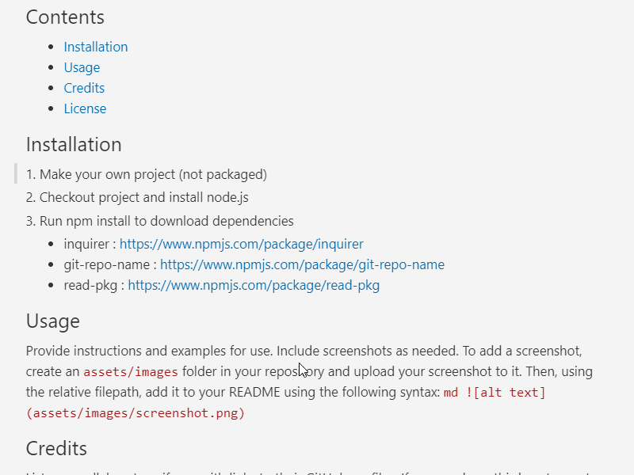

# README Gen
## Description
A node project that prompts user for details then generates a linked, badged and polished README.md file and saves it to the directed local repository checkout

## Badges

Badges aren't necessary, per se, but they demonstrate street cred. Badges let other developers know that you know what you're doing. Check out the badges hosted by [shields.io](https://shields.io/). You may not understand what they all represent now, but you will in time.

## Contents
- [Why](#why)
- [Installation](#installation)
- [Usage](#usage)
- [Credits](#credits)
- [License](#license)

## Why
My mantra is that if it gets done, it gets done well, if it gets done twice, it gets automated. This is said automation and it is designed to save time for all future projects. There is a  tradeoff between the level of readme customization, and the promptness of the process. Bearing that in mind, some avenues for readme customization have been left unexplored simply to reduce complexity. In the process of building this I learned a lot about distinguishing vanity metrics from utility metrics. I have added some visual metrics but where possible, I have opted for meaningful design choices over flash.

## Installation
```
1. Make your own project (not packaged)
2. Checkout project and install node.js
3. Run npm install to download dependencies
```

## Dependencies
```
inquirer : https://www.npmjs.com/package/inquirer 
git-repo-name : https://www.npmjs.com/package/git-repo-name
read-pkg : https://www.npmjs.com/package/read-pkg 
```
## Usage
```
1. Run index.js entry point
2. Follow user prompts to build README.md file. Note you will need the local repository path  
3. Prompts - gather options appear in ascending order of privilege

* local repo root path: UserInputAbsolutePath eg "C:\Users\user\Documents\localProjectRepo" Required   
- project title: [readPackage-name], [readOrigin-repoName], userInput  
- project version: [readPackage-version], userInput  
- profile name: [readPackage-author], [readOrigin-ownerProfile], userInput  
- collaborators: [readOrigin-repoContributors], userInput  
- description: [readPackage-description], UserInput  
- dependencies: [readPackage-dependencies], UserInputCSV  
- license: [readPackage-license], UserInputChoice  
- project motivation: Long string  
- installation: Long string  
- usage: long string   
- credits: UserInput   
- features: UserInput  
- how to contribute: UserInput    
- tests: [readPackage-scripts.test], UserInput  
```
#### NOTE: if there is a package.json file but any of the readPackage.json commands find an empty value or a clashed value with the origin repo, console alert package.json doesn't match origin repo details

<!-- ; -->

## Credits
List your collaborators, if any, with links to their GitHub profiles.
If you used any third-party assets that require attribution, list the creators with links to their primary web presence in this section.
If you followed tutorials, include links to those here as well.
## License
The last section of a high-quality README file is the license. This lets other developers know what they can and cannot do with your project. If you need help choosing a license, refer to [https://choosealicense.com/](https://choosealicense.com/).
---
🏆 The previous sections are the bare minimum, and your project will ultimately determine the content of this document. You might also want to consider adding the following sections.
## Features
If your project has a lot of features, list them here.
## How to Contribute
If you created an application or package and would like other developers to contribute it, you can include guidelines for how to do so. The [Contributor Covenant](https://www.contributor-covenant.org/) is an industry standard, but you can always write your own if you'd prefer.
## Tests
Go the extra mile and write tests for your application. Then provide examples on how to run them here.
